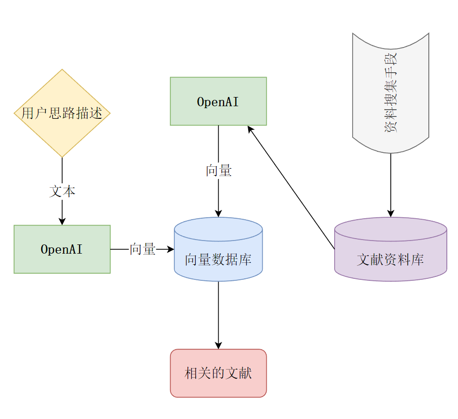

# Ezsearch

## 能做什么的？

*Ezsearch* 是一个使用`python`编写的开源社科类文献检索项目。它将每篇社科文献的标题、关键词、摘要等信息转化为文本向量，可以允许用更具体的描述来对文献进行语义检索。

简单来说，就是提供一段思路描述（例如：“*中国式现代化的一大阻碍是基层治理体系还不够完善*”），就能检索到与该描述最相关的文献。

## 为什么要做这个项目？

在社科文献中，语义检索可以发挥更大的作用，因为：

1. 社科文献的描述往往比较抽象，用词有时不够精确，而传统检索使用的关键词又往往过于宽泛，难以准确描述文献的主题。
2. 有时，社会科学家可能有一些突发的灵感，但由于学术知识脉络过于零散，苦于不知道如何寻找有关研究。

目前市面上的主流社科文献检索工具（例如知网）使用的还是字词匹配方式进行文献检索。但是，基于语义的检索可以提供更精确的检索结果，并且可以帮助人们更好地查找相关文献。

## 项目的目标

*Ezsearch* 的目标是开发一个开源的社科类文献检索项目，它可以：

1. 自动化爬取最新的学术文献（题目、摘要、关键词），并将其转化为词向量，存储在向量数据库当中。
2. 接收用户的思路描述，并将其转化为文本向量，与向量数据库的文献向量进行相似度计算，返回最相关的文献。
3. 支持英文检索功能。

## 项目的架构



*Ezsearch* 的架构如上图所示。

1. 资料收集：负责自动化/手动地爬取学术文献，并将其保存到文献资料库当中。
2. 向量数据库：使用`chromadb `:
   1. 存储已爬取的学术文献的文本
   2. 支持基于文本描述的检索

## 当前进度

*EZsearch*已经有一个基于`R shinny`的版本，欢迎大家进行测试：

https://plumber.shinyapps.io/EZsearch/

## 文档说明

- `datasets`: 存储文献原始资料
- `chroma_db`: 向量数据库
- `ezsearch_add.py`: 向向量数据库添加新文献
- `ezsearch.py`: 项目**主程序**，起到检索功能
- `output`: 检索结果输出到这个文件夹

使用前，请建立一个`api_keys.py`文件，在其中放入你的*api_key*和*api_base*，例如：
```
api_key = "xx-xxxxxxxxxxxxxxxxxxxxxxxx",
api_base= "https://api.xxxxxx.xxx/v1",
```

## 期刊资料

目前包含的期刊内容：

- [《社会学研究》](http://shxyj.ajcass.org/)：2000年第1期到2023年第6期。`ids`范围为`[shxyj0, shxyj1644]`
- [《社会》](https://www.society.shu.edu.cn/CN/1004-8804/home.shtml):2005年第1期到2023年第5期。`ids`范围为`[sh0, sh1166]`

## 如何贡献

- 向向量数据库追加新的文献
- 优化项目的检索功能
- 增加英文检索功能（中文通过openAI的api进行翻译，然后将翻译后的文字转化为向量，与英文文献匹配）